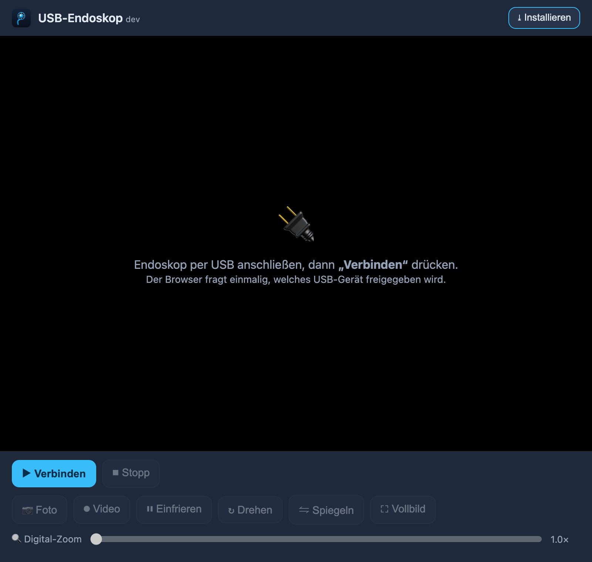

# USB-Endoskop

**Eine installierbare, vollständig lokale Web-App, die das i4season / "Usee Plus" USB-Endoskop direkt in deinem Browser über WebUSB streamt — eine vertrauenswürdige, quelloffene Alternative zur zwielichtigen Hersteller-App, die diesem Endoskop beiliegt.**

[🇬🇧 English](README.md) | 🇩🇪 Deutsch

[](LICENSE)
[](manifest.webmanifest)
[](sw.js)
[](index.html)
[](#wie-es-funktioniert)



## Was es ist

Billige USB-Endoskope kommen fast immer mit einer proprietären Handy-App zweifelhafter Herkunft — Closed Source, voller Werbung und mit Berechtigungsforderungen, die ein Kamera-Viewer überhaupt nicht braucht. Dieses Projekt ist das Gegenteil: **eine installierbare Web-App, ohne Build-Schritt, ohne Abhängigkeiten und mit null Netzwerkanfragen.** Das Kamerabild verlässt dein Gerät nie.

Sie tut genau eine Sache: das **i4season / "Usee Plus"** USB-Endoskop (USB `VID 0x2ce3` / `PID 0x3828`, vermarktet als "Geek szitman useepluscam") über **WebUSB** verbinden und sein Live-Video anzeigen — keine native App, keine Hersteller-Software.

## Wie es funktioniert

Dieses Endoskop ist **kein** Standard-**UVC**-Gerät (USB Video Class). Deshalb sieht dein Betriebssystem es nie als Webcam, und der Browser kann es nicht mit den üblichen Kamera-APIs öffnen — genau darum liefert der Hersteller stattdessen eine proprietäre Android-App aus.

Also geht die App einen anderen Weg: Sie beansprucht das Vendor-Interface des Geräts über **WebUSB** und spricht das **reverse-engineerte Vendor-Protokoll** direkt im Browser. In der Praxis heißt das zwei einfache Vendor-**Control-Transfers**, um den Stream zu starten, und dann das Lesen roher **YUYV422**-Frames über den Bulk-Endpoint `0x82` und deren Umwandlung in RGB auf einem Canvas.

Die ganze Geschichte, die Mitschnitte und die genauen Protokollkonstanten stehen in
**[docs/REVERSE_ENGINEERING.md](docs/REVERSE_ENGINEERING.md)** und **[PROTOCOL_NOTES.md](PROTOCOL_NOTES.md)**.

## Als App installieren

USB-Endoskop ist eine installierbare **Progressive Web App (PWA)**:

- Klicke auf die Schaltfläche **⤓ Installieren** in der Kopfzeile, sobald sie erscheint, oder nutze das **Installations-Icon** deines Browsers in der Adressleiste.
- Nach der Installation läuft es auf dem Homescreen / Desktop und funktioniert **vollständig offline** — der Service Worker cacht die App-Shell, und es gibt weiterhin null externe Anfragen.
- Unter **iOS / iPadOS** kannst du es über Safaris **"Zum Home-Bildschirm"** zum Homescreen hinzufügen, aber beachte: Dort kann es **nicht streamen** — kein Browser unter iOS hat WebUSB (siehe [Plattform-Unterstützung](#plattform-unterstützung)).

## Funktionen

- **Live-Vorschau** — verbindet sich automatisch, sobald das bekannte Endoskop eingesteckt wird
- 📷 **Foto-Aufnahme** — JPEG, Dateiname mit Zeitstempel
- ⏺ **Video-Aufnahme** — WebM
- ⏸ **Standbild** — praktisch bei wackliger Sonde
- ↻ **Drehen** / ⇋ **Spiegeln** — Endoskopbilder stehen oft auf dem Kopf; die Transformation wird auch auf das gespeicherte Foto angewendet
- 🔍 **Digitaler Zoom**
- ⛶ **Vollbild**
- ⤓ **Installierbar / funktioniert offline** — als PWA

## Schnellstart

WebUSB erfordert einen **Chromium-basierten Browser** und einen **sicheren Kontext**: `https://` oder `http://localhost`. Das direkte Öffnen von `index.html` per Doppelklick (`file://`) wird von Browsern blockiert, also liefere sie lokal aus.

### Auf einem PC / Laptop

Stecke das Endoskop ein, dann:

```bash
git clone https://github.com/esdreiem/usb-endoscope.git
cd usb-endoscope
python3 -m http.server 8000
# → open http://localhost:8000 in Chrome / Edge / Brave
```

Drücke **Verbinden**, um den Stream zu starten, **Stopp**, um ihn zu beenden.

### Oder nutze die gehostete Version

Die App wird statisch über **GitHub Pages** ausgeliefert — sie macht trotzdem keine Netzwerkanfragen, das Bild bleibt also lokal:

**<https://esdreiem.github.io/usb-endoscope/>**

## Plattform-Unterstützung

WebUSB ist eine **rein Chromium-basierte** API, daher hängt die Unterstützung von der Browser-Engine ab.

| Plattform | Browser | WebUSB-Streaming | Hinweise |
|---|---|---|---|
| **Desktop** (Windows / macOS / Linux) | Chrome, Edge, Brave, Opera | ✅ Funktioniert | Die empfohlene Art, die App zu nutzen. |
| **Desktop** | Firefox | ❌ Nein | Mozilla hat sich gegen die Implementierung von WebUSB entschieden. |
| **Desktop** | Safari | ❌ Nein | Keine WebUSB-Unterstützung. |
| **Android** | Chrome / Chromium | ✅ Funktioniert | Jeder Chromium-basierte Android-Browser. |
| **iOS / iPadOS** | jeder Browser | ❌ Nein | Jeder iOS-Browser ist auf WebKit gezwungen, keiner hat also WebUSB — du kannst die PWA installieren, aber nicht streamen. |

In einem nicht-Chromium-Browser zeigt die App eine klare Meldung **"öffne dies in Chrome / Edge / Brave"** statt einer toten Oberfläche. In allen Fällen ist ein **sicherer Kontext** (`https://` oder `http://localhost`) erforderlich.

## Unterstützte Geräte

| Gerät | VID / PID | Interface | Status |
|---|---|---|---|
| i4season "Usee Plus" — "Geek szitman useepluscam" (Modell `su4p-002`) | `0x2ce3` / `0x3828` | WebUSB-Vendor-Protokoll | ✅ Getestet |

Du hast ein **anderes Vendor-Endoskop**? Hilf uns, es hinzuzufügen — siehe [CONTRIBUTING.md](CONTRIBUTING.md).

## Wie das WebUSB-Protokoll reverse-engineert wurde

Die USB-Deskriptoren des "Usee Plus"-Endoskops geben Vendor-Interfaces namens `iAP Interface` und `com.useeplus.protocol` an — nicht UVC — was die Untersuchung durch einige aufwändige Sackgassen schickte (ein altes "BB AA" / MJPEG-Bulk-Protokoll, dann ein tiefer Umweg über Apples iAP2-Zubehör-Handshake). Der Durchbruch kam von einem gerooteten Handy und einem Frida-Hook auf der nativen `USBDEVFS`-ioctl-Schnittstelle, der aufzeichnete, was die **echte** Android-App tatsächlich über USB sendet. Es stellte sich heraus, dass es nur zwei einfache Vendor-Control-Transfers waren, gefolgt von rohen YUYV422-Bulk-Reads — der ausgefeilte Handshake war die ganze Zeit ein Ablenkungsmanöver.

Die ganze Geschichte, die Mitschnitte und die genauen Protokollkonstanten stehen in
**[docs/REVERSE_ENGINEERING.md](docs/REVERSE_ENGINEERING.md)** und **[PROTOCOL_NOTES.md](PROTOCOL_NOTES.md)**.

## Datenschutz

Datenschutz ist ein Kernziel dieses Projekts, kein nachträglicher Gedanke:

- **In sich geschlossen** — keine externen oder Drittanbieter-Anfragen, keine CDN-Schriften, kein Tracking. Alle Assets sind vom selben Origin.
- **Vollständig offline-fähig** — einmal als PWA installiert, funktioniert es ganz ohne Netzwerk.
- **Das Kamerabild verlässt dein Gerät nie.**
- Fotos (JPEG) und Videos (WebM) werden **ausschließlich als lokale Downloads** gespeichert.
- Der gesamte Quellcode ist lesbar und überprüfbar — fang mit [`index.html`](index.html) an.

## Mitwirken

Dies ist das erste Open-Source-Projekt des Autors, und Beiträge sind sehr willkommen. Das Nützlichste, was du tun kannst, ist **helfen, dein Endoskop hinzuzufügen**: Wenn du ein nicht-UVC-Vendor-Gerät hast, helfen ein Deskriptor-Dump und ein Protokoll-Mitschnitt enorm weiter. Wie du loslegst, steht in [CONTRIBUTING.md](CONTRIBUTING.md).

## Danksagungen

Vorarbeiten, die als wertvolle frühe Wegweiser dienten. Ehrlicher Hinweis: Diese beschreiben den alten BB-AA / MJPEG-Weg, der **nicht** dem entspricht, was die funktionierende WebUSB-Implementierung nutzt — aber sie wiesen früh die Richtung.

- [hbens/geek-szitman-supercamera](https://github.com/hbens/geek-szitman-supercamera)
- [MAkcanca/useeplus-linux-driver](https://github.com/MAkcanca/useeplus-linux-driver)
- [linux-media V4L2 driver patch](https://marc.info/?l=linux-media&m=175756642100535)

## Lizenz

Lizenziert unter **GPL-3.0-or-later**. Den vollständigen Text findest du in [LICENSE](LICENSE).

Copyright © 2026 [esdreiem](https://github.com/esdreiem).
